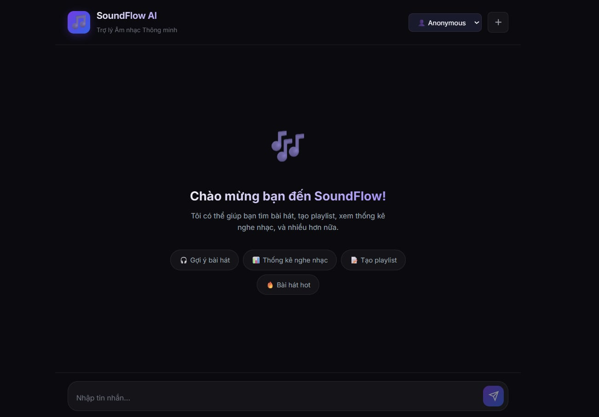
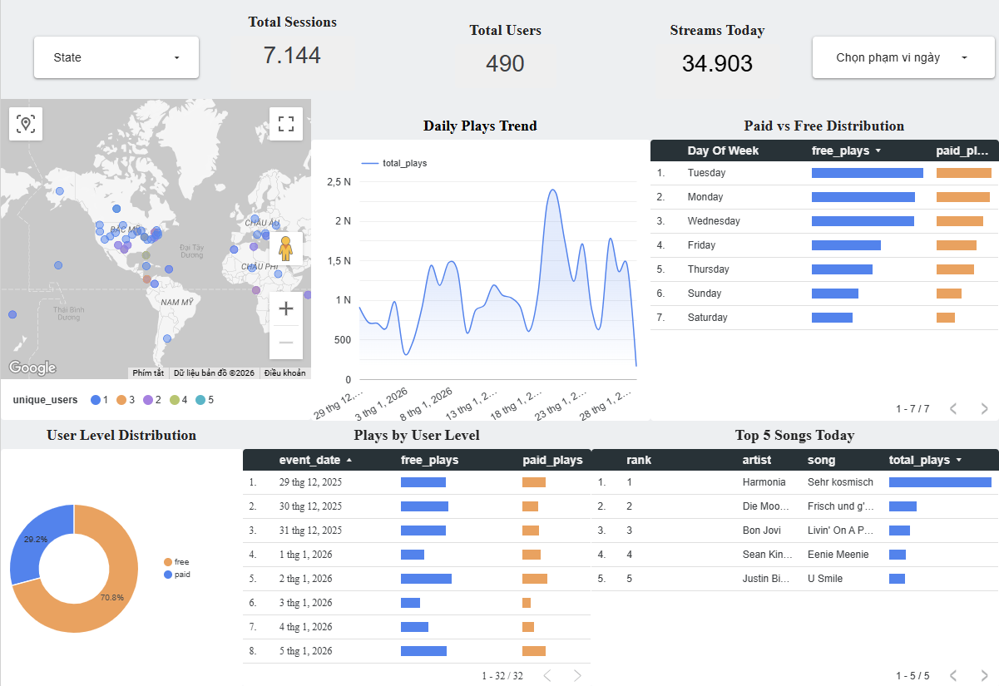

# 🎵 SoundFlow

A data pipeline with GCP Pub/Sub, Spark Streaming, dbt, Docker, Dagster, Terraform, GCP and much more!

## 📋 Objective

The project will stream events generated from a fake music streaming service (like Spotify) and create a data pipeline that consumes the real-time data. The data coming in would be similar to an event of a user listening to a song, navigating on the website, authenticating. The data would be processed in real-time and stored to the data lake periodically. The batch job will then consume this data, apply transformations, and create the desired tables for our dashboard to generate analytics. We will try to analyze metrics like popular songs, active users, user demographics etc.

## Dataset

[Eventsim](https://github.com/Interana/publish_events) is a program that generates event data to replicate page requests for a fake music web site. The results look like real use data, but are totally fake. The docker image is borrowed from [viirya's fork](https://github.com/viirya/publish_events) of it, as the original project has gone without maintenance for a few years now.

Eventsim uses song data from [Million Songs Dataset](http://millionsongdataset.com) to generate events. For this project, approximately **50,000 events** were generated across 4 event types:

| Event Type | Description |
|------------|-------------|
| `listen_events` | User plays a song |
| `page_view_events` | User views a page |
| `auth_events` | Login/logout actions |
| `status_change_events` | Subscription changes |

**Analytics Metrics:** Popular songs, Active users, User demographics, Listening patterns.

## 📦 Tech Stack

| Component | Technology |
|-----------|------------|
| Data Generator | Python Script (publish_events.py) |
| Message Broker | GCP Pub/Sub |
| Data Lake | Google Cloud Storage |
| Data Warehouse | BigQuery |
| Transformation | dbt |
| Orchestration | Dagster |
| Infrastructure | Terraform |
| Containerization | Docker |
| Dashboard | Looker Studio / Metabase |
| AI Chatbot | LangGraph, Gemini, FastAPI, ChromaDB |

## 🏗️ Architecture

```
Python Script ──▶ GCP Pub/Sub ──▶ Python ETL ──▶ GCS (Parquet)
                                              │
                                              ▼
                              BigQuery (External Tables)
                                              │
                                              ▼
                              dbt (staging → marts)
                                              │
                                   ┌──────────┴──────────┐
                                   ▼                     ▼
                               Dashboard             AI Chatbot
```

## 🤖 AI Chatbot Preview



SoundFlow includes an intelligent AI Chatbot powered by **Google Gemini** and **LangGraph**. It utilizes RAG (Retrieval-Augmented Generation) with **ChromaDB** to recommend personalized songs, fetch real-time analytics from BigQuery, and assist users with their subscriptions.

📖 **Detailed Configuration & Setup**: Check out the [Chatbot Documentation](docs/CHATBOT_CONFIG.md).

## 📈 Dashboard Preview



## �🚀 Quick Start

### Prerequisites

- Docker Desktop
- Python >= 3.10  
- GCP Account + Service Account key
- Terraform >= 1.0

### 1. Setup

```bash
git clone <repo-url>
cd Data_streaming_pipeline

python -m venv .venv
.venv\Scripts\Activate.ps1   # Windows
pip install -r requirements.txt

cp .env.example .env
# Edit .env with your GCP settings
```

### 2. Infrastructure

```bash
cd terraform
terraform init
terraform apply
```

### 3. Run Pipeline

```bash
# Start all services
docker compose up -d

# Access Dagster UI: http://localhost:3000
# Access Redpanda Console: http://localhost:8080
```

> 📖 Details: [docs/QUICKSTART.md](docs/QUICKSTART.md)

## 📁 Project Structure

```
├── dagster/          # Orchestration (assets, schedules)
├── dbt/              # Transformations (13 models, 31 tests)
├── publish_events/         # Event generator config
├── redpanda/         # Pub/Sub topic config
├── spark_streaming/  # ETL scripts
├── terraform/        # GCP infrastructure
├── dashboard/        # Looker Studio / Metabase setup
├── scripts/          # Utility scripts
└── docs/             # Documentation
```

## 📊 Data Models

| Mart | Description |
|------|-------------|
| `mart_daily_summary` | Daily KPIs |
| `mart_hourly_metrics` | Hourly metrics |
| `mart_active_users` | User engagement |
| `mart_top_songs` | Top 100 songs |
| `mart_top_artists` | Top 100 artists |
| `mart_location_analytics` | Geographic analytics |

> 📖 Details: [dashboard/looker_studio/DATA_DICTIONARY.md](dashboard/looker_studio/DATA_DICTIONARY.md)

## 🐳 Docker Services

| Service | Port | Description |
|---------|------|-------------|
| Redpanda | 9092 | Pub/Sub topic |
| Redpanda Console | 8080 | Kafka UI |
| Dagster | 3000 | Orchestration UI |
| Metabase | 3030 | Dashboard (optional) |

```bash
# GCP Mode (default)
docker compose up -d

# Local Mode (with Postgres)
docker compose -f docker-compose.yml -f docker-compose.local.yml up -d

# With Dashboard
docker compose --profile dashboard up -d
```

## 📚 Documentation

| Doc | Content |
|-----|---------|
| [QUICKSTART.md](docs/QUICKSTART.md) | Quick start guide |
| [GCP_CONFIG.md](docs/GCP_CONFIG.md) | GCP configuration |
| [DAGSTER_GUIDE.md](docs/DAGSTER_GUIDE.md) | Using Dagster |
| [GCP_UI_GUIDE.md](docs/GCP_UI_GUIDE.md) | GCP Console guide |

## ⚠️ Notes

- **GCP Costs**: Use Free Tier or $300 credit for new accounts
- **Credentials**: Do not commit `.json` credential files
- **Cleanup**: Run `terraform destroy` when not in use

## 🔧 Troubleshooting

```bash
# Check environment
python scripts/check_env.py

# View logs
docker compose logs -f dagster-webserver
```

## 📈 Future Improvements

- [ ] Managed Kafka (Confluent Cloud)
- [ ] Cloud Composer for orchestration
- [ ] Data quality monitoring
- [ ] Real-time dashboard

## 🔄 CI/CD

GitHub Actions workflow for dbt:

| Trigger | Actions |
|---------|---------|
| PR to `main` | Lint → Test (dev) |
| Push to `main` | Lint → Test → Deploy (prod) |

> 📖 Setup: [.github/workflows/README.md](.github/workflows/README.md)

---

**Credits**: Based on [Streamify](https://github.com/ankurchavda/streamify) and [DataTalks.Club](https://datatalks.club) [DE Zoomcamp](https://github.com/DataTalksClub/data-engineering-zoomcamp).
